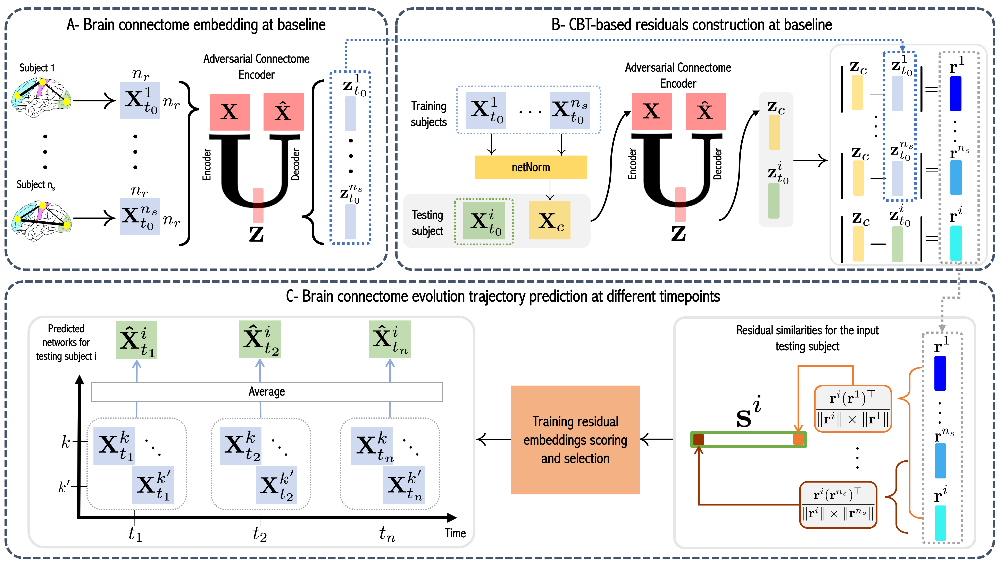

# RESNets in Python (Residual Embedding Similarity-based Network Selection)
RESNets (Residual Embedding Similarity-based Network Selection) for brain network evolution trajectory prediction from a single baseline observation, recoded by Ahmet Serkan Göktaş. Please contact goktasah16@itu.edu.tr for further inquiries. Thanks. 



> **RESNets (Residual Embedding Similarity-based Network Selection) for brain network evolution trajectory prediction from a single baseline observation** <br/>
> Ahmet Serkan Göktaş<sup>1,2</sup>, Alaa Bessadok<sup>1</sup>, Islem Rekik<sup>1,2</sup><br/>
> <sup>1</sup> BASIRA Lab, Faculty of Computer and Informatics, Istanbul Technical University, Istanbul, Turkey
> <sup>2</sup> Istanbul Technical University, Istanbul, Turkey
> <sup>3</sup> LATIS Lab, ISITCOM, University of Sousse, Sousse, Tunisia
>
> **Abstract:** *Predicting the evolution trajectories of brain data from a baseline timepoint is a challenging task in the fields of neuroscience and neuro-disorders. While existing predictive frameworks are able to handle Euclidean structured data (i.e, brain images), they might fail to gener- alize to geometric non-Euclidean data such as brain networks. Recently, a seminal brain network evolution prediction framework was introduced capitalizing on learning how to select the most similar training network samples at baseline to a given testing baseline network for the target prediction task. However, this rooted the sample selection step in using Euclidean or learned similarity measure between vectorized training and testing brain networks. Such sample connectomic representation might include irrelevant and redundant features that could mislead the train- ing sample selection step. Undoubtedly, this fails to exploit and preserve the topology of the brain connectome. To overcome this major draw- back, we propose Residual Embedding Similarity-Based Network selec- tion (RESNets) for predicting brain network evolution trajectory from a single timepoint. RESNets first learns a compact geometric embedding of each training and testing sample using adversarial connectome em- bedding network. This nicely reduces the high-dimensionality of brain networks while preserving their topological properties via graph convo- lutional networks. Next, to compute the similarity between subjects, we introduce the concept of a connectional brain template (CBT), a fixed network reference, where we further represent each training and test- ing network as a deviation from the reference CBT in the embedding space. As such, we select the most similar training subjects to the test- ing subject at baseline by comparing their learned residual embeddings with respect to the pre-defined CBT. Once the best training samples are selected at baseline, we simply average their corresponding brain net- works at follow-up timepoints to predict the evolution trajectory of the testing network. Our experiments on both healthy and disordered brain networks demonstrate the success of our proposed method in comparison to RESNets ablated versions and traditional approaches. Our RESNets code is available at http://github.com/basiralab/RESNets.*


This work is published in MICCAI 2020 and it is selected as oral presentation at the “PRedictive Intelligence in MEdicine|” (PRIME) workshop, Lima, Peru. Residual Embedding Similarity-Based Network Selection (RESNets) is a GNN based framework for predicting brain network evolution trajectories from a single observation at baseline. Our RESNets framework comprises three key steps (1) brain connectome embedding at baseline, (2) CBT-based residuals construction at baseline and, (3) brain connectome evolution trajectory prediction.

## Dependencies

The code has been tested with Python 3.8 and TensorFlow 1.5 on OSX, Windows 10 and Ubuntu 16.04. GPU is not needed to run the code. You also need some of the following Python packages, which can be installed via pip3:


* [Python 3.8+](https://www.python.org/)
* [Tensorflow 1.5.0](https://www.tensorflow.org/)
* [Scikit-learn 0.23.0+](https://scikit-learn.org/stable/)
* [Matplotlib 3.1.3+](https://matplotlib.org/)
* [Numpy 1.18.1+](https://numpy.org/)

# Demo

We provide a demo code for the usage of RESNets for predicting brain network evolution trajectories from a single observation at baseline. In demo.py we run RESNets on a simulated dataset constructed by the input from the user.

To run our demo:
```bash
python3 demo.py
```

# Data format

First of all, we denote number of subjects as n_s, number of regions of interest as n_r, number of timepoints as n_t. In order to use our framework, you need to supply matrices as feature vectors. The size of a feature vector can
be calculated as n_f = (n_r * (n_r - 1) / 2). Our frameworks expects the data in following formats:

* Feature vector of the testing subject with dimensions of (1 x n_f) 
* Baseline population with dimensions of (n_s x n_f)
* Follow-up data of baseline population (n_t x n_s x n_f)<br/>
* Number of selected subjects (i.e K) (scalar)
* Number of regions of interest (i.e n_r) (scalar)


# Simulating time-dependent (longitudinal) brain graphs

In our demo, we provide a function that simulates an example longitudinal dataset. All you need to do is to provide:
* Number of subjects at baseline population (n_s)
* Number of timepoints (n_t)
* Number of regions of interest (n_r)
* Number of selected subjects (K)


# Example Results
If you set number of subjects at baseline population (n_s) to 8, number of timepoints (n_t) to 3, number of regions of interest (n_r) to 10 and number of selected subjects (K) to 3, you will get following output (The feature vectors are anti-vectorized for better visualization).
.


<p align="center">
  
</p>

# Related references

Banka, A., Rekik, I. In: Adversarial Connectome Embedding(ACE) for Mild Cognitive Impairment Identification Using Cortical Morphological Networks. (2019) 74–82. [DOI: https://doi.org/10.1007/978-3-030-32391-2_8]

Dhifallah, S., Rekik, I.: Estimation of connectional brain templates using selective multi-view network normalization. [https://www.researchgate.net/publication/336211539_Estimation_of_Connectional_Brain_Templates_using_Selective_Multi-View_Network_Normalization] [https://github.com/basiralab/netNorm-PY]

# Please cite the following paper when using RESNets:

```latex
@inproceedings{goktas2020,
title={Residual Embedding Similarity-Based Network Selection for Predicting Brain Network Evolution Trajectory from a Single Observation
},
author={Goktas, Ahmet Serkan and Bessadok, Alaa and Rekik, Islem},
booktitle={International Workshop on PRedictive Intelligence In MEdicine},
year={2020},
organization={Springer}
}
```

# Acknowledgement

I. Rekik is supported by the European Union’s Horizon 2020 research and in- novation programme under the Marie Sklodowska-Curie Individual Fellowship grant agreement No 101003403 (http://basira-lab.com/normnets/).


# License
Our code is released under MIT License (see LICENSE file for details).


